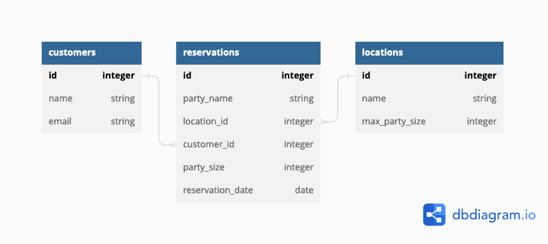

# practice-cc-reserv-o-matic

# Practice Code Challenge - Reserv-O-Matic

A local restaurant needs to replace their old system for tracking reservations.
This is going to be your first job out of bootcamp.

This will be a fullstack application with a React frontend and a Flask backend.

You will not have to build the React frontend, but it is there for you to test
if your Flask API is working.

Your job is to build out the Flask API to meet the deliverables described below.

---

## Setup

Let's first get all our dependencies setup:
Make sure you are in the main folder (above server and client folders).
Open two terminal windows side-by-side so you can do the following.

```console
$ pipenv install && pipenv shell
$ npm install --prefix client
```

There is some starter code in the `seed.py` file so that once you've
generated the models, you'll be able to create data to test your application.

You can run your Flask API on [`localhost:5555`](http://localhost:5555) by
navigating to the `server/` directory and running:

```console
$ python app.py
```

You can run your React app in a separate window on [`localhost:5173`](http://localhost:5173) by running the following from the main directory:

```console
$ npm run dev --prefix client
```

You are not being assessed on React, and you don't have to update any of the React
code; the frontend code is available just so that you can test out the behavior
of your API in a realistic setting.

There are also tests included which you can run using `pytest` to check your work.

Depending on your preference, you can either check your progress by:

- Running `pytest` and seeing if your code passes the tests
- Running the React application in the browser and interacting with the API via
  the frontend
- Running the Flask server and using Postman to make requests

---

## Models

You need to create the following relationships:

- A `Customer` has many `Reservation`s, and has been to many `Location`s through `Reservation`s
- A `Location` has many `Reservation`s, and has many `Customer`s through `Reservation`s
- A `Reservation` belongs to a `Customer` and a `Location`

Start by creating the models and migrations for the following database tables:



Add any code needed in the model files to establish the relationships.

Then, run the migrations and seed file:

```console
$ flask db revision --autogenerate -m'lets go'
$ flask db upgrade head
$ python seed.py
```

> If you aren't able to get the provided seed file working, you are welcome to
> generate your own seed data to test the application.

---

## Validations

Add validations to the `Customer` model:

- must have a `name`
- must have a unique `email`

Add validations to the `Location` model:

- must have a `name`
- must have a `max_party_size`

Add validations to the `Reservation` model:

- must have a `date`
- must have a `party_name`
- must have a `customer_id` for the customer
- must have a `location_id` for the location
- must have a `party_size` and it cannot be larger than the `Location`s `max_party_size`.

- a customer cannot have more than one reservation for the same `date` and `location`

---

## Routes

Set up the following routes. Make sure to return JSON data in the format
specified along with the appropriate HTTP verb.

### GET /customers

Return JSON data in the format below. **Note**: the ideal return would be
similar to below without additional nested data.

```json
[
  {
    "id": 1,
    "name": "Steve Rogers",
    "email": "captain_america@usa.gov"
  },
  {
    "id": 2,
    "name": "Tony Stark",
    "email": "ironman@starkindustries.com"
  }
]
```

### GET /customers/<int:id>

If the `Customer` exists, return JSON data in the format below.
**Note**: you will need to serialize the data for this response differently than
for the `GET /customers` route. Make sure to include an array of reservations for each
customer.

```json
{
  "id": 4,
  "name": "Alyssa Stanley",
  "email": "pamelamartinez@example.org",
  "reservations": [
    {
      "customer_id": 4,
      "party_size": 5,
      "id": 48,
      "party_name": "Birthday",
      "reservation_date": "2023-06-03",
      "location": {
        "max_party_size": 16,
        "name": "Party City",
        "id": 8
      },
      "location_id": 8
    }
  ]
}
```

If the `Customer` does not exist, return the following JSON data, along with
the appropriate HTTP status code:

```json
{
  "error": "404: Customer not found"
}
```

### POST /customer

This route should create a new `Customer`. It should accept an object with the
following properties in the body of the request:

```json
{
  "name": "Zoe",
  "email": "thisisfake@aol.com"
}
```

If the `Customer` is created successfully, send back a response with the new
`Customer`:

```json
{
  "id": 23,
  "name": "Zoe",
  "email": "thisisfake@aol.com"
}
```

If the `Customer` is **not** created successfully, return the following JSON data,
along with the appropriate HTTP status code:

```json
{
  "error": "400: Validation error"
}
```

### GET /locations

Return JSON data in the format below:

```json
[
  {
    "name": "Shepard-Smith",
    "id": 1,
    "max_party_size": 18
  },
  {
    "name": "Nelson Group",
    "id": 2,
    "max_party_size": 14
  }
]
```

### POST /reservations

This route should create a new `Reservation` that is associated with an
existing `Customer` and `Location`. It should accept an object with the following
properties in the body of the request:

```json
{
  "reservation_date": "2023-06-16",
  "customer_id": 1,
  "location_id": 3,
  "party_size": 5,
  "party_name": "birthday"
}
```

If the `Reservation` is created successfully, send back a response with the data
related to the `Reservation`:

```json
{
  "id": 53,
  "party_size": 2,
  "reservation_date": "2023-06-18",
  "customer_id": 14,
  "customer": {
    "email": "michael54@example.net",
    "id": 14,
    "name": "Roger Wright"
  },
  "location_id": 4,
  "location": {
    "max_party_size": 17,
    "id": 4,
    "name": "Gardner Inc"
  },
  "party_name": "avengers"
}
```

If the `Reservation` is **not** created successfully, return the following JSON data,
along with the appropriate HTTP status code:

```json
{
  "error": "400: Validation error"
}
```

### DELETE /reservations/<int:id>

If the `Reservation` exists, it should be removed from the database.

After deleting the `Reservation`, return an _empty_ response body, along with the
appropriate HTTP status code.

If the `Reservation` does not exist, return the following JSON data, along with
the appropriate HTTP status code:

```json
{
  "error": "404: Activity not found"
}
```

Hint for reservation_date. This needs to be in a date format. How can the string be turned into the right format?

Hint:datetime.datetime.strptime(data.get()"reservation_date"), "%Y-%m-%d").date()
